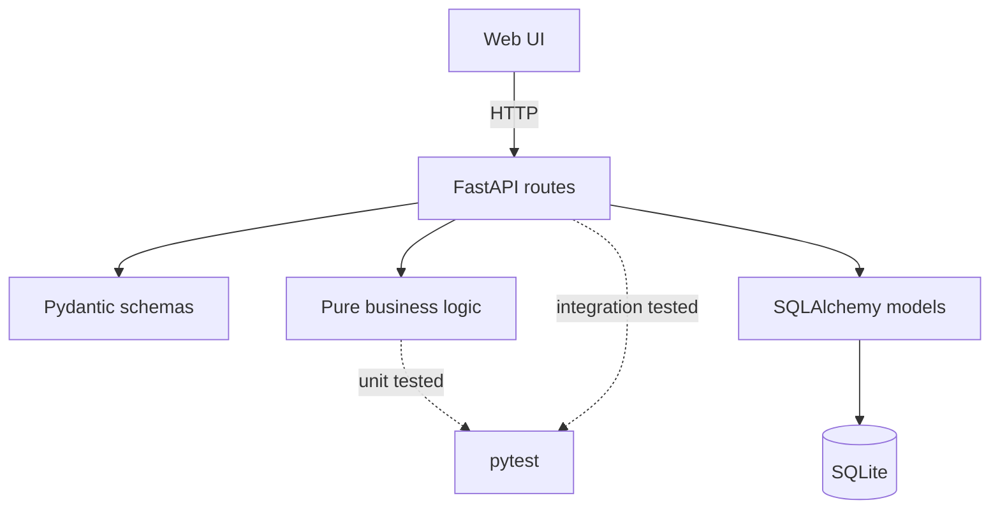

# Coffee Order Tracker

A small full-stack app for tracking coffee shop orders, customer order **streaks**,
and the most popular drinks. Built with FastAPI, SQLite, and a vanilla web UI.

## Why this project

I wanted something more than a CRUD wrapper around a database. The core of this
project is the **streak calculation** — similar to the "current streak / longest
streak" logic in habit-tracking apps. It's a self-contained algorithm (see
`app/logic.py`) that's fully unit tested in isolation from the API and database
layers.

## Features

- **Web UI** — log orders, browse customers, check streaks, and see popular drinks
- Log a coffee order for a customer (creates the customer automatically if new)
- List all customers with order counts and streak stats
- View logged orders with pagination support
- Get a customer's **current streak** and **longest streak** of consecutive days
  with at least one order
- Get the most popular drinks across all customers
- Input validation with readable error messages

## Tech stack

- **FastAPI** — web framework and automatic OpenAPI docs
- **SQLAlchemy** — ORM over SQLite
- **Pydantic** — request/response validation
- **pytest** — unit tests (pure logic) and integration tests (API + DB)
- **Vanilla HTML/CSS/JS** — lightweight frontend, no build step

## Architecture



**Layering choices:**

- `app/logic.py` holds streak and popularity calculations with **no** FastAPI or
  database imports, so the algorithm can be tested in isolation.
- `app/main.py` is a thin API layer: validate input, query the DB, call logic,
  return responses.
- Tests use an in-memory SQLite database so the real `coffee_tracker.db` file
  is never touched during `pytest`.

## Project structure

```
coffee-tracker/
├── app/
│   ├── main.py        # FastAPI app and route handlers
│   ├── models.py      # SQLAlchemy ORM models
│   ├── schemas.py     # Pydantic request/response schemas
│   ├── database.py    # DB engine/session setup
│   └── logic.py       # Streak + popularity calculation (pure functions)
├── static/
│   ├── index.html     # Web UI
│   ├── css/styles.css
│   ├── js/app.js
│   └── favicon.svg
├── tests/
│   ├── test_logic.py  # Unit tests for streak/popularity logic
│   └── test_api.py    # Integration tests for the API endpoints
├── requirements.txt
└── README.md
```

## Running it locally

```bash
# 1. Clone and enter the project
git clone https://github.com/yamamaadem2/coffee-tracker.git
cd coffee-tracker

# 2. Create a virtual environment (recommended)
python3 -m venv venv
source venv/bin/activate   # on Windows: venv\Scripts\activate

# 3. Install dependencies
pip install -r requirements.txt

# 4. Run the server
uvicorn app.main:app --reload
```

Open **http://127.0.0.1:8000** in your browser for the web UI.

The API docs (Swagger UI) are at `http://127.0.0.1:8000/docs`.

## Example usage

**Log an order:**
```bash
curl -X POST http://127.0.0.1:8000/orders \
  -H "Content-Type: application/json" \
  -d '{"customer_name": "Layla", "drink": "Spanish Latte"}'
```

**List customers:**
```bash
curl http://127.0.0.1:8000/customers
```

**Check a customer's streak:**
```bash
curl http://127.0.0.1:8000/customers/Layla/streak
```

**Get the most popular drinks:**
```bash
curl http://127.0.0.1:8000/drinks/popular
```

**Paginate orders:**
```bash
curl "http://127.0.0.1:8000/orders?limit=10&offset=0"
```

## Running the tests

```bash
pytest -v
```

21 tests covering streak/popularity logic, API behavior, validation, pagination,
and edge cases like unknown customers and broken streaks.

## What I learned

- How to **separate business logic from the web layer** so core algorithms stay
  testable without spinning up a server or database.
- How to structure a FastAPI project with **models, schemas, routes, and
  dependencies** instead of putting everything in one file.
- How to write **both unit and integration tests** — pure function tests for
  logic, `TestClient` + in-memory SQLite for API endpoints.
- How to add **query-parameter validation** (pagination, limits) and return
  **human-readable validation errors** instead of raw framework output.

## Possible next steps

- Add authentication so each coffee shop only sees its own customers
- Swap SQLite for PostgreSQL for production use
- Deploy to Render or Railway for a live demo link
